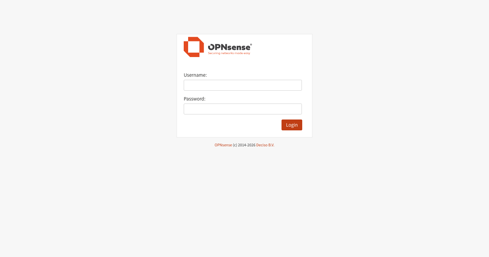
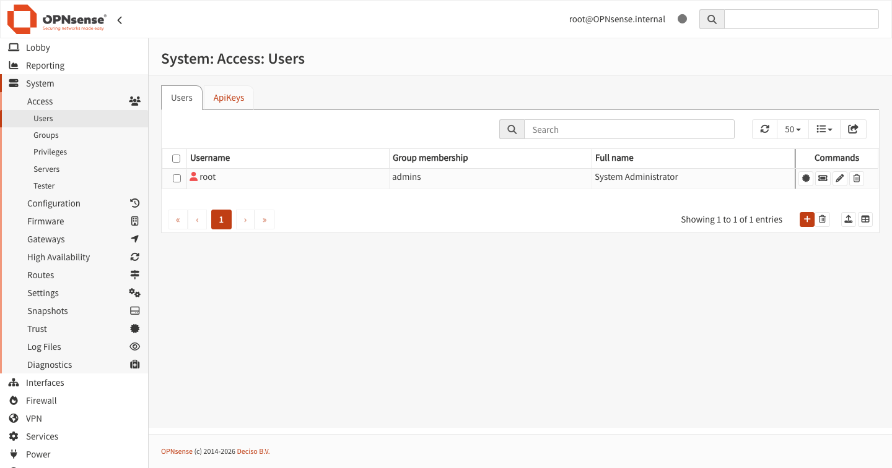
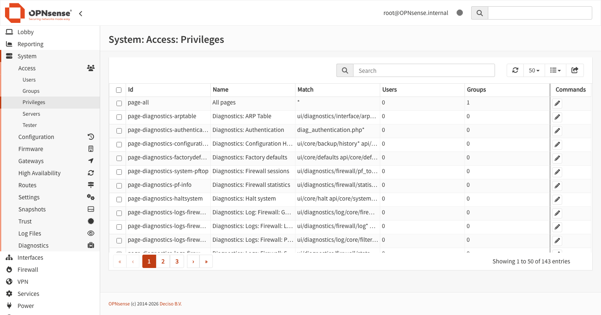
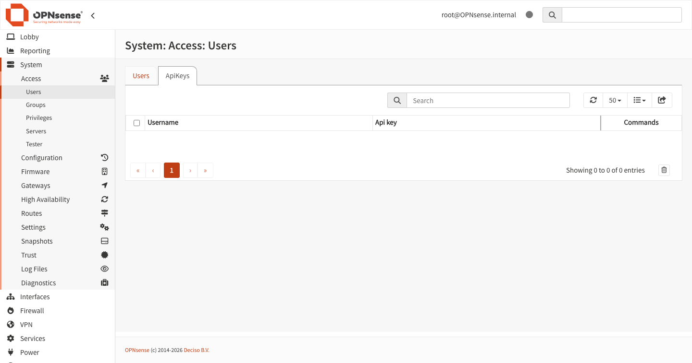
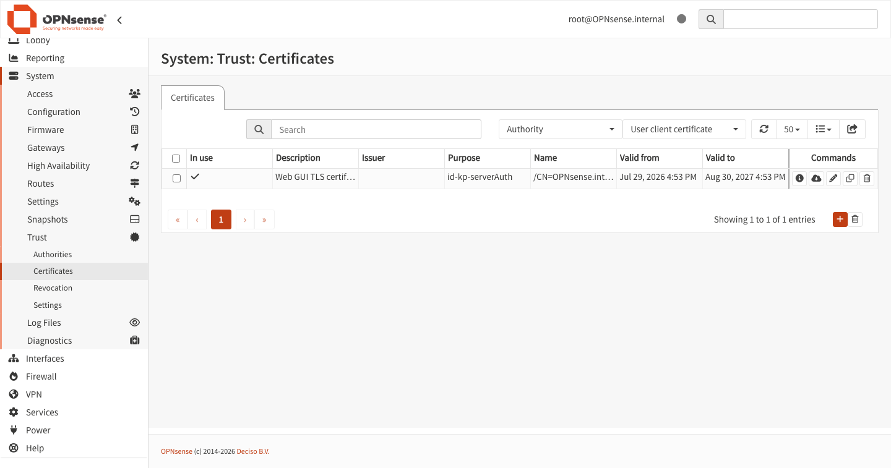

# Connect your own OPNsense

A step-by-step walkthrough: create a least-privilege account on your firewall, trust its certificate,
store the credentials safely, and answer questions about your network from Claude Code, Codex or
OpenCode. About 15 minutes.

> **Use a firewall you are allowed to break.** This project's own rule is that live development
> targets a disposable lab VM, never a production firewall. Everything below stays read-only, but a
> home router your household depends on is production for that household. If you only want to try the
> server, skip this page entirely and run `npm run test:product1b`, which boots its own throwaway
> OPNsense and needs no credential at all.

**What you get.** Four read-only tools — `server_status`, `opn_describe`, `opn_get`, `opn_list` —
covering system status, the service list, and host aliases. That is the whole surface. Writing is
experimental, off by default, and not part of this page.

**Requirements.** Node.js 22.19 or newer within major 22, macOS or Linux (native Windows is not
supported), and an OPNsense system you administer.

Every screenshot on this page is a real capture of OPNsense 26.7, taken automatically from this
project's pinned disposable VM by `npm run docs:capture`. Nothing here is a mock-up. Your release may
differ; the menu paths in the text are what to trust if a picture no longer matches.

---

## 1. Install the server

```bash
npx -y @gabrielion/opnsense-mcp --version
```

That downloads the published package on first use and prints its version number. (Releases before
0.1.1 predate the `--version` flag and print `Error` instead — the download still proves the package
resolves, but prefer the current release.) Do not run this from inside a clone of this repository:
there, npx resolves the local package instead of the registry.

Or install from a clone, which is also what you want if you intend to modify it:

```bash
git clone https://github.com/gabrielion/OPNSenseMCP.git
cd OPNSenseMCP
npm ci --ignore-scripts && npm run build
```

From a clone the server is `node /absolute/path/to/OPNSenseMCP/dist/main.js`. Use that wherever this
page writes `npx -y @gabrielion/opnsense-mcp`.

## 2. Create a dedicated user

Sign in to your firewall's web interface.



Go to **System → Access → Users** and add an account with the `+` button below the table.



Give it a name you will recognise later, such as `mcp-readonly`. Do not reuse `root` or an existing
administrator: a dedicated account is what lets you revoke this access later without touching anything
else. It needs no shell and no interactive login.

## 3. Grant only three privileges

Go to **System → Access → Privileges** for that user and grant exactly:

```text
page-system-status
page-status-services
user-config-readonly
```



| Tool                      | Privilege it needs                                              |
| ------------------------- | --------------------------------------------------------------- |
| `server_status`           | none — it reports the MCP process itself                        |
| `opn_describe`            | none — it reads the local catalogue                             |
| `opn_get system.status`   | `page-system-status`                                            |
| `opn_list core.services`  | `page-status-services`                                          |
| `opn_list firewall.alias` | `page-firewall-alias-edit` (add only if you want alias listing) |

The read-only set above deliberately does **not** authorize alias listing. Add
`page-firewall-alias-edit` only if you want it.

## 4. Issue the API key

Still under **System → Access → Users**, open your new account for editing, scroll down to its **API
keys** section, and use the `+` there.

This is the step people miss, for two reasons. First, the control is inside the user's own edit form,
below the fold — the **ApiKeys** tab on the Users page only _lists_ keys, it does not create them:



Second, nothing appears on screen when you click `+`. A small text file **downloads**, containing two
lines:

```text
key=...
secret=...
```

That file is the only copy. Keep it until step 6, then delete it. Never paste those values into a chat
window, a shell argument, or a file inside a git repository.

## 5. Trust the certificate

OPNsense ships a self-signed certificate. This server has **no** option to disable TLS verification —
unlike most alternatives, which offer a `VERIFY_SSL=false` switch. That is deliberate: a permanent
verify-off flag exposes every request forever. Instead, trust that one certificate explicitly.

Go to **System → Trust → Certificates** and export the web GUI certificate as PEM.



Or fetch it from the command line and check it against the fingerprint shown on that page:

```bash
openssl s_client -connect FIREWALL:443 -servername FIREWALL_DNS_NAME </dev/null 2>/dev/null | openssl x509 -out "$HOME/opnsense-ca.pem"
```

```bash
openssl x509 -in "$HOME/opnsense-ca.pem" -noout -fingerprint -sha256
```

Compare that fingerprint with the one on the firewall before trusting it. If they differ, stop.

**If your certificate names only an IP address**, reissue it on the firewall with a DNS name. The
`tlsServerName` setting used to bridge an IP URL to a hostname certificate rejects IP literals, so
there is no way around this in configuration.

If your firewall already uses a certificate that chains to a CA your machine trusts, skip this section.

## 6. Store the credentials

```bash
npx -y @gabrielion/opnsense-mcp configure
```

It asks for the HTTPS origin, the key, the secret, an optional CA file path and an optional DNS TLS
server name. Secrets are never echoed and never passed as process arguments. It writes
`~/Library/Application Support/opnsense-mcp/config.json` on macOS, or
`$XDG_CONFIG_HOME/opnsense-mcp/config.json` (else `~/.config/...`) on Linux, with directory mode `0700`
and file mode `0600`.

Three limits worth knowing before you hit them:

- it needs a **real terminal** on both streams, so it cannot be piped or scripted;
- it **never overwrites** an existing file, so rotating a key means deleting the file first;
- it always writes to the default path and **ignores `OPNSENSE_CONFIG_FILE`** — that variable is read
  by the _server_, to load a file kept elsewhere.

Every failure prints the single word `Error`, on purpose, so nothing about the path or the credentials
leaks. If you need a longer timeout than the 10-second default, write the JSON by hand instead; the
exact schema is in the [README](../README.md#connect-your-opnsense-instance).

## 7. Verify before wiring any client

Do these in order. Each one rules out a different failure.

```bash
curl -u "KEY:SECRET" --cacert "$HOME/opnsense-ca.pem" https://FIREWALL/api/core/system/status
```

Proves DNS, TLS trust and credentials in one request. Use **this** endpoint, not
`/api/core/firmware/status`: the least-privilege account above is correctly refused there with `403`,
so that popular connection test would fail on a perfectly good setup.

```bash
npx -y @modelcontextprotocol/inspector --cli npx -y @gabrielion/opnsense-mcp --method tools/list
```

Proves the MCP surface independently of any assistant. Expect exactly four tools.

## 8. Wire your assistant

**Claude Code**

```bash
claude mcp add --env READ_ONLY=true --transport stdio opnsense -- npx -y @gabrielion/opnsense-mcp
```

The `--` before the command is required, and do not place the server name directly after `--env` — it
would be parsed as another `KEY=value`.

**Codex** — add to `~/.codex/config.toml`:

```toml
[mcp_servers.opnsense]
command = "npx"
args = ["-y", "@gabrielion/opnsense-mcp"]

[mcp_servers.opnsense.env]
READ_ONLY = "true"
```

**OpenCode** — add a project-level `opencode.json`:

```json
{
  "$schema": "https://opencode.ai/config.json",
  "mcp": {
    "opnsense": {
      "type": "local",
      "command": ["npx", "-y", "@gabrielion/opnsense-mcp"],
      "environment": { "READ_ONLY": "true" }
    }
  }
}
```

Never put the API key or secret in a client configuration file. The server reads them from the private
file written in step 6.

If you installed from a clone, replace the command with your absolute `node /path/to/dist/main.js`.
Always use absolute paths: a stdio server can start with an undefined working directory.

## 9. Confirm and ask something

Run `/mcp` in Claude Code or Codex, or `opencode mcp list`. The server should read `connected`.

`claude mcp add` writes the configuration **without validating it**, so an `Added` line only means the
file was written. `connected` is the real signal.

Then ask, in your own words:

- _What is my OPNsense system status?_
- _Which services are running on my firewall?_

Leave `ALLOWED_RESOURCES` and `ENABLED_FEATURE_FLAGS` unset. An empty allow-list authorizes every read
and no write, which is what you want. Setting it partially silently removes tools.

## Troubleshooting, by what you actually see

| Symptom                                                             | Cause and fix                                                                                          |
| ------------------------------------------------------------------- | ------------------------------------------------------------------------------------------------------ |
| `getaddrinfo ENOTFOUND`, connection refused                         | Host, route, or no firewall rule allowing your machine to the management interface.                    |
| `self-signed certificate`, `unable to verify the first certificate` | Step 5: export the CA and set `caFile`.                                                                |
| `Hostname/IP does not match certificate`                            | Set `tlsServerName` to the certificate's DNS name, or reissue the certificate.                         |
| HTTP 401                                                            | Wrong key or secret — check for trailing whitespace when copying.                                      |
| HTTP 403, or an unexpectedly empty list                             | A privilege from step 3 is missing. `/api/core/firmware/status` returning 403 is expected and correct. |
| `Error` from `configure`                                            | A configuration already exists (delete it to rotate), or the path/mode/ownership is unsafe.            |
| Server shows `failed` in `/mcp`                                     | Run the step 7 checks in order; they separate firewall problems from client problems.                  |
| Client starts but sees no tools                                     | Node version outside major 22, or a relative path in the client configuration.                         |

## What is not supported

Native Windows. Production-firewall claims. Durable backups, audit trail, restore or rollback. Raw API
dispatch, SSH, or a dashboard. Alias reads are bounded to the first 100 host entries.

See [docs/project-status.md](project-status.md) for the full, current list, and
[docs/evidence/](evidence/) for the machine-readable proofs behind every claim on this page.

OPNsense is a trademark of Deciso B.V. This project is independent and not affiliated with Deciso.
